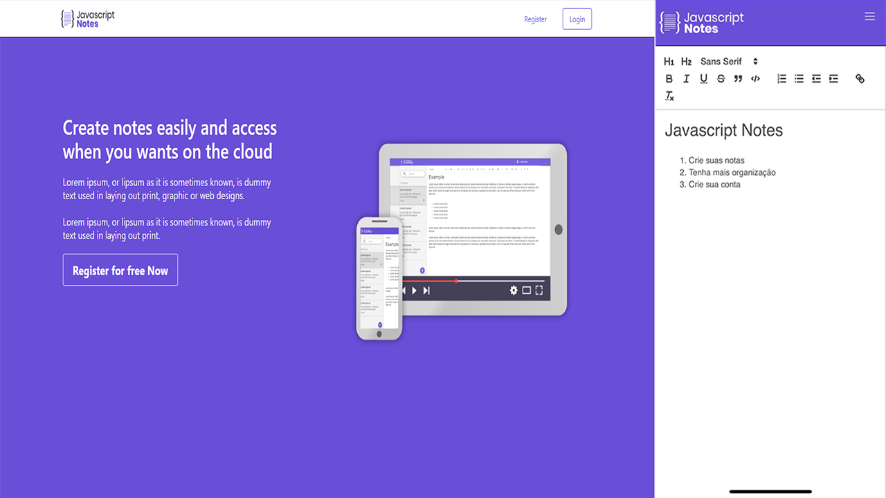

<h1 align="center">
  
  <br />
</h1>
<p align="center">
  <a href="#page_facing_up-descrição">Descrição</a>&nbsp;&nbsp;&nbsp;|&nbsp;&nbsp;&nbsp;
  <a href="#-tecnologias">Tecnologias</a>&nbsp;&nbsp;&nbsp;|&nbsp;&nbsp;&nbsp;
  <a href="#clipboard-Funcionalidades">Funcionalidades</a>&nbsp;&nbsp;&nbsp;|&nbsp;&nbsp;&nbsp;
  <a href="#closed_book-instalação">Instalação</a>&nbsp;&nbsp;&nbsp;|&nbsp;&nbsp;&nbsp;
  <a href="#man-Autor">Autor</a>&nbsp;&nbsp;&nbsp;|&nbsp;&nbsp;&nbsp;
  <a href="#memo-Licença">Licença</a>
</p>



## :page_facing_up: Descrição
O Javascript Notes é uma aplicação onde o usuário pode se organizar de forma mais ágil através de notas personalizadas, onde o mesmo poderá ter as usas
informações disponíveis para serem acessadas de qualquer lugar, assim mantendo o controle das suas informações.

## 🛠 Tecnologias
Este projeto foi desenvolvido com as seguintes tecnologias

- [Node.js](https://nodejs.org/en/)
- [React.js](https://pt-br.reactjs.org/)
- [MongoDB](https://www.mongodb.com/2)

## :clipboard: Funcionalidades
- [x] Criar e editar a sua conta.
- [x] Criar/Editar/Excluir notas.
- [x] Excluir sua conta.

## :closed_book: Instalação

### Pré-requisitos
Antes de começar, você vai precisar ter instalado em sua máquina as seguintes ferramentas:
[Git](https://git-scm.com), [Node.js](https://nodejs.org/en/).
Além disto é bom ter um editor para trabalhar com o código como [VSCode](https://code.visualstudio.com/)

### 🎲 Rodando o Back End

```bash
# Clone este repositório
$ git clone https://github.com/FeSilva-dev/JavascriptNotes.git

# Vá para o backend
$ cd javascript_note_api

# Instale as dependências
$ npm install

# Execute a API
$ npm start

# O servidor inciará na porta 3333 - url <http://localhost:3333>
```

### 💻️ Rodando o Front End

```bash
# Vá para a pasta web
$ cd javascript_note

# Instale as dependências
$ npm install

# Execute aplicação
npm start

# O app vai está rodando na porta 3000 - acesse <http://localhost:3000>
```

## :man: Autor

<a href="https://github.com/FeSilva-dev">
 
 <br />
 <sub><b>Felipe Silva</b></sub>
</a>


Feito com carinho por Felipe Silva :wave::wave: Entre em contato!🚀

## :memo: Licença

Copyright © 2020 [Felipe Silva](https://github.com/FeSilva-dev).
